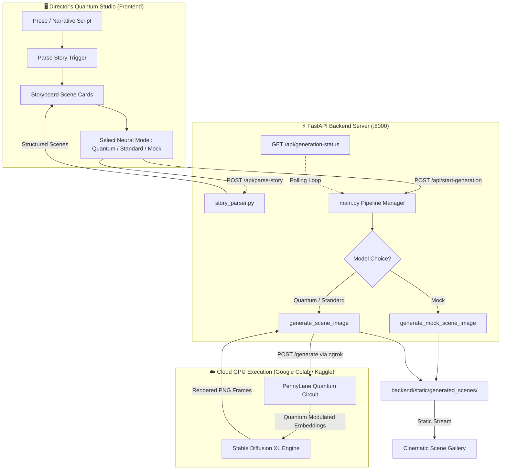

<div align="center">

# ⚛️ MUSIA — Multilingual Story Illustration
### *Cinematic Visual Storytelling Powered by Quantum-Enhanced Neural Diffusion*

[](https://fastapi.tiangolo.com)
[](https://pytorch.org)
[](https://pennylane.ai/)
[](https://stability.ai)
[](LICENSE)

<br/>

> **MUSIA** deconstructs written narratives into sequential, director-grade storyboards and generates high-fidelity visual illustrations for each scene using a hybrid **Parameterized Quantum Circuit (PQC)** feature enhancer coupled with **Stable Diffusion XL**.

<br/>

---

</div>

## 🌌 Overview

Translating long-form prose and multilingual stories into cohesive visual storyboards requires both narrative comprehension and deep semantic prompt fidelity. **MUSIA** solves this by unifying:

1. **Intelligent Narrative Dissection Engine**: Automatically parses complex text, novels, or scripts into distinct cinematic scene cues using chapter identification, sentence chunking, and context enrichment.
2. **Quantum Feature Enhancement (PQC)**: Modulates latent prompt embeddings across simulated multi-qubit PennyLane quantum circuits to optimize text representation in high-dimensional Hilbert space before passing to the latent diffusion pipeline.
3. **Decoupled Cloud GPU Pipeline**: Supports hybrid execution across **Google Colab / Kaggle cloud GPU tunnels** via ngrok, with an ultra-fast local mock mode for instant frontend prototyping.
4. **Director's "Quantum Studio" UI**: An immersive, glassmorphic dark-mode web application featuring real-time quantum particle simulation, live storyboard timeline tracking, and 16:9 cinematic render galleries.

---

## ⚡ Key Features

- **⚛️ Quantum-Enhanced Latent Embeddings**: Custom `QuantumFeatureEnhancer` (`best_pqc_enhancer_fulldataset.pt` & `adapter_model.safetensors`) transforms prompt embeddings through quantum state vectors.
- **🎬 Intelligent Scene Chunking**: Automatically segments prose into chronological scenes while filtering conversational noise and preserving descriptive atmosphere.
- **⚡ Dual Engine Generation**:
  - **Quantum-Enhanced SDXL (Colab/Cloud GPU)**: High-resolution cinematic scene generation via an active ngrok tunnel.
  - **Standard SDXL**: High-speed vanilla latent diffusion.
  - **Fast Preview Mock**: Instant (<1s) local procedural storyboard visualization for rapid script verification.
- **💎 High-End Quantum Studio UI**:
  - Frosted glass cards (`backdrop-filter: blur(16px)`), neon cyan/violet/indigo glows.
  - Interactive HTML5 Quantum Canvas with mouse-reactive entangled particle physics.
  - Live progress monitoring with background polling and asynchronous task execution.
- **🌐 Multilingual & Cross-Platform**: Handles diverse languages and narrative structures gracefully.

---

## 🏗️ Architecture



---

## 🚀 Quick Start

### 1. Prerequisites
- Python 3.9+ (Python 3.10 / 3.11 recommended)
- Git

### 2. Clone the Repository
```bash
git clone https://github.com/your-username/musia.git
cd musia
```

### 3. Setup Virtual Environment
```bash
# Windows (PowerShell)
python -m venv venv
.\venv\Scripts\Activate.ps1

# Linux / macOS
python3 -m venv venv
source venv/bin/activate
```

### 4. Install Dependencies
```bash
pip install -r requirements.txt
```

### 5. Launch the FastAPI Backend & Studio
```bash
uvicorn backend.main:app --reload --host 127.0.0.1 --port 8000
```

Open your browser and navigate to:
```
http://127.0.0.1:8000
```
*(The interactive API documentation is available at `http://127.0.0.1:8000/docs`)*

### 6. Run the Test Suite
Execute the automated test suite (25 tests covering story parsing, quantum pipelines, and REST APIs):
```bash
python -m unittest discover -s tests -p "test_*.py"
```

---

## ☁️ Google Colab GPU Setup (For Quantum/Standard Diffusion)

1. Open the MUSIA GPU notebook in **Google Colab** (set Hardware Accelerator to **T4** or **A100** GPU).
2. Install the Colab dependencies:
   ```bash
   pip install pennylane diffusers transformers accelerate pyngrok torch
   ```
3. Expose your FastAPI server via ngrok in the notebook:
   ```python
   from pyngrok import ngrok
   tunnel = ngrok.connect(5000)
   print(f"Public Tunnel URL: {tunnel.public_url}")
   ```
4. Copy the generated ngrok URL and update `COLAB_NGROK_URL` inside `backend/generate_on_kaggle.py`:
   ```python
   COLAB_NGROK_URL = "https://your-active-ngrok-tunnel.ngrok-free.dev"
   ```
5. Choose **Quantum-Enhanced SDXL** in the web studio dropdown and hit **Launch Pipeline**!

> **Note:** If you want to test the full frontend storyboard workflow without a GPU, simply select **"⚡ Fast Local Preview (Instant Mock)"** in the model dropdown.

---

## 📂 Project Structure

```
Main_musia_project/
├── backend/
│   ├── main.py                     # FastAPI application & async task controller
│   ├── story_parser.py             # Intelligent chapter/scene segmentation logic
│   ├── generate_on_kaggle.py       # Cloud GPU tunnel client & local procedural fallback
│   └── static/
│       └── generated_scenes/       # Rendered storyboard PNG frames
├── frontend/
│   └── index.html                  # Quantum Studio single-page application
├── best_pqc_enhancer_fulldataset.pt # Pretrained Parameterized Quantum Circuit weights
├── adapter_model.safetensors       # LoRA / diffusion adapter weights
├── requirements.txt                # Python environment specifications
└── README.md                       # Comprehensive documentation
```

---

## 🛠️ API Reference

| Endpoint | Method | Description |
|---|---|---|
| `/` | `GET` | Serves the Quantum Studio director interface |
| `/api/health` | `GET` | Health status confirmation |
| `/api/parse-story` | `POST` | Dissects raw narrative text into formatted scene prompts |
| `/api/start-generation` | `POST` | Initiates asynchronous image generation (`quantum`, `standard`, `mock`) |
| `/api/stop-generation` | `POST` | Sends graceful halt signal to active pipeline |
| `/api/generation-status` | `GET` | Polling endpoint for real-time progress and frame URLs |

---

## 🔬 Scientific Background: Quantum Feature Enhancement

Standard text encoders (such as CLIP or T5) map text tokens into Euclidean embedding spaces. The **Parameterized Quantum Circuit (PQC)** enhancer utilizes quantum superposition and entanglement:

$$\lvert \psi(\theta, x) \rangle = U(\theta, x) \lvert 0^{\otimes n} \rangle$$

By mapping latent vectors into $2^n$-dimensional Hilbert space with variational unitary transformations, MUSIA introduces non-linear semantic modulation that improves scene style consistency across multi-scene narrative transitions.

---

## 🤝 Contributing

Contributions, issues, and feature requests are welcome!
1. Fork the Project
2. Create your Feature Branch (`git checkout -b feature/QuantumEnhancement`)
3. Commit your Changes (`git commit -m 'Add new quantum entanglement gate'`)
4. Push to the Branch (`git push origin feature/QuantumEnhancement`)
5. Open a Pull Request

---

## 📜 License

Distributed under the **MIT License**. See `LICENSE` for more information.

<div align="center">
  <sub>Crafted with passion for AI, Quantum Computing, and Digital Storytelling.</sub>
</div>
